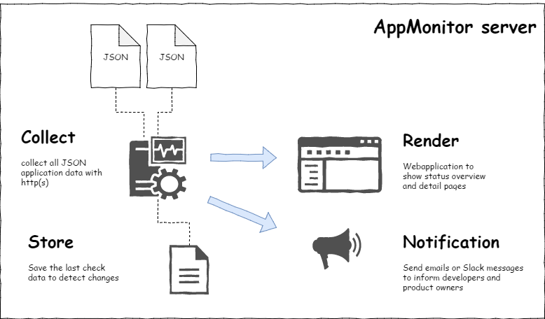

[TOC]
# How does it work? #

The appmonitor is a monitoring tool that consists of 2 parts

- **client** (for each webapplication to check)
  - is executed on a incoming http request (there is no agent)
  - makes necessary checks for the full functionality of a website 
  - uses the credentials of the application
  - responds information as JSON
  - more: [Client](20_Client/10_Introduction.md) , [PHP-Client](30_PHP-client/10_Introduction.md)
- **server** instance
  - collects all JSON data and presents an overview over all checks and websites
  - sends notifications to server admins (read from server config) plus developers and product owners (coming from clients metadata)
  - more: [Server](10_Server/10_Installation.md)

The server should run as a deamon (but this is not a must for testing).
It collects all monitoring data from all your web apps by sending an http(s) request.

The health-check is done from the view of the application server.

The client sends back a result in JSON format.

# Clients #

For PHP applications a client with pre defined checks is delivered.

For Non-PHP clients you need to write your own checks and create a response in the pre defined syntax.
  

# Server #

After collecting all results it stores the results. It renders a web gui and sends notifications.

