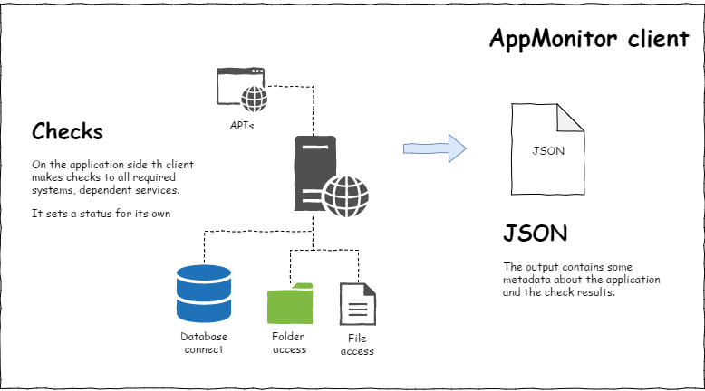

# APPMONITOR #

Free software and Open Source from University of Bern :: IML - Institute of Medical Education

https://github.com/iml-it/appmonitor

- - -

# Description #

The application monitor is an additional tool to the classic system monitoring of a servers and its services. It makes checks from the point of view of the application. With its credentials and permissions started on the application hosts.

# Features #

- PHP 7 on server (clients can be implemented in other languages too)
- small: 400 kb + docs; no database required

Server webgui
- Filter the view by selecting tags
- Multi language (English and German language file so far)
- Optional service for permanent checks and notification 24/7
- Notification as email, Slack message (respecting sleep times i.e. during the night)
- CLI tool to automate settings in the server config (with Puppet, Ansible, ...)

**Screenshot**:

# How does it work? #

The appmonitor is a monitoring tool that consists of 2 parts
- **client** (for each webapplication to check)
  - is executed on a incoming http request (there is no agent)
  - makes necessary checks for the full functionality of a website 
  - uses the credentials of the application
  - responds information as JSON
  - more: [Client](client.md) , [PHP-Client](client-php.md)
- **server** instance
  - collects all JSON data and presents an overview over all checks and websites
  - sends notifications to server admins (read from server config) plus developers and product owners (coming from clients metadata)
  - more: [Server](server.md)

# Installation #

Go to page [Server](server.md) to install the server that contains the server and client components.

# Workflow #

The server should run as a deamon (but this is not a must).
It collects all monitoring data from all your web apps by sending an http(s) request.

The health-check is done from the view of the application server.

The client sends back a result in JSON format.

# Clients #

For PHP applications a client with pre defined checks is delivered.

For Non-PHP clients you need to write your own checks and create a response in the pre defined syntax.
  

**more**: [Client](client.md) | [PHP-Client](client-php.md)

# Server #

After collecting all results it stores the results. It renders a web gui and sends notifications.

**more**: [Server](server.md)

